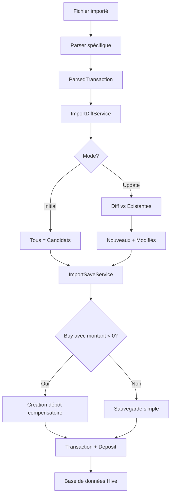

# 📊 Rapport Synthétique - Gestion des Imports et Transactions

**Date:** 29 décembre 2025  
**Objet:** Analyse de la logique d'import et de gestion des liquidités

---

## 🎯 Synthèse Exécutive

Le système d'import de My-Invests gère **5 sources différentes** (Trade Republic PDF, BoursoBank PDF, Revolut CSV, La Première Brique Excel, AI Import) avec **2 modes** (Initial, Actualisation) et une logique de **compensation automatique** des liquidités. La complexité vient de la nécessité de réconcilier des états financiers incomplets (positions sans historique complet) avec la contrainte de maintenir une cohérence des liquidités.

### ⚠️ Point d'Attention Principal
**Problème identifié :** Le système crée automatiquement des dépôts compensatoires pour tous les achats importés, ce qui peut créer une confusion sur la distinction entre capital réellement investi et liquidités disponibles.

---

## 📦 Architecture Actuelle

### 1. Sources d'Import

| Source | Format | Parser | Types de Transactions | Spécificités |
|--------|--------|--------|----------------------|--------------|
| **Trade Republic** | PDF | `TradeRepublicParser` | Achats/Ventes individuels | Parsing ligne par ligne |
| **Trade Republic** | PDF | `TradeRepublicAccountStatementParser` | Relevé de compte complet | Crypto/PEA/CTO, dépôts/retraits |
| **BoursoBank** | PDF | `BoursoramaParser` | Achats/Ventes | Parsing standard |
| **Revolut** | CSV/Excel | `RevolutParser` | 8 types (Buy, Sell, Dividend, Fees, Deposit, Withdrawal, Interest) | Format structuré |
| **La Première Brique** | Excel | `LaPremiereBriqueParser` | Crowdfunding immobilier | Métadonnées étendues (durée, rendement) |

### 2. Modes d'Import

#### 🆕 Mode Initial (`ImportMode.initial`)
- **Usage :** Première importation, snapshot de positions existantes
- **Comportement :** Importe toutes les transactions du fichier
- **Liquidités :** Crée des dépôts compensatoires automatiques
- **Note générée :** `"Import initial depuis [source]"`

#### 🔄 Mode Actualisation (`ImportMode.update`)
- **Usage :** Import incrémental, ajout des nouvelles transactions
- **Comportement :** Détecte les doublons, identifie les modifications
- **Liquidités :** Crée AUSSI des dépôts compensatoires (✅ correction récente)
- **Note générée :** `"Actualisation depuis [source]"`

### 3. Flux de Traitement



---

## 💰 Logique de Gestion des Liquidités

### Principe Fondamental
**Règle :** Tout achat importé (montant négatif) génère automatiquement un dépôt compensatoire du même montant (positif) à la même date.

### Justification
Lorsqu'on importe un snapshot de positions (ex: relevé Trade Republic montrant 5000€ d'actions détenues), ces achats ont été réalisés avec de l'argent **déjà présent** sur le compte. Sans compensation, l'application afficherait `-5000€` de liquidités, ce qui est faux.

### Implémentation (ImportSaveService)

```dart
// Pour chaque achat importé (Buy avec montant < 0)
if (parsed.type == TransactionType.Buy && parsed.amount < 0) {
  final dateKey = parsed.date.toIso8601String().substring(0, 10);
  
  // Agrégation par date
  crowdfundingDepositsByDate[dateKey] = 
      (crowdfundingDepositsByDate[dateKey] ?? 0) + parsed.amount.abs();
}

// Création du dépôt compensatoire
transactions.add(Transaction(
  id: 'deposit_auto_$dateStr',
  type: TransactionType.Deposit,
  amount: amount, // Positif
  notes: "Apport auto - [Type] (mode depuis source)",
));
```

### Notes Générées

| Type d'Import | Note du Dépôt |
|---------------|---------------|
| Crowdfunding | `"Apport auto - Crowdfunding (Import initial depuis la_premiere_brique)"` |
| Autres actifs | `"Apport auto - Neutralisation import (Import initial depuis trade_republic)"` |

---

## 🔍 Détection des Doublons (ImportDiffService)

### Clé d'Identité (Complète)
**Format :** `date|assetRef|type|quantity(4 déc)|amount(2 déc)`  
**Usage :** Détection des doublons stricts  
**Exemple :** `2025-01-15|apple|Buy|10.0000|-1500.00`

### Clé de Matching (Partielle)
**Format :** `date|assetRef|type`  
**Usage :** Détection des transactions modifiées (mode actualisation)  
**Exemple :** `2025-01-15|apple|Buy`

### Seuils de Modification
- **Quantité :** > 0.0001 (4 décimales)
- **Montant :** > 0.01€ (2 décimales)

### Comportement par Mode

| Situation | Mode Initial | Mode Actualisation |
|-----------|-------------|-------------------|
| Identité exacte | ❌ Ignoré (doublon) | ❌ Ignoré (doublon) |
| Match partiel | ➕ Ajouté comme nouveau | ✏️ Proposé en "Modifié" si seuils dépassés |
| Aucun match | ➕ Ajouté comme nouveau | ➕ Ajouté comme nouveau |

---

## 🧩 Impact sur le Capital Investi

### Calcul Théorique
Le capital investi devrait être la somme des montants négatifs des transactions de type `Buy` :

```dart
double capitalInvested = 0;
for (final tx in transactions.where((t) => t.type == TransactionType.Buy)) {
  if (tx.amount < 0) {
    capitalInvested += tx.amount.abs(); // On somme en valeur absolue
  }
}
```

### ⚠️ Problème Actuel
Avec le système de compensation automatique :
- **Liquidités finales = 0€** ✅ (Correct techniquement)
- **Capital investi = Somme des Buy** ✅ (Correct)
- **Mais confusion possible :** L'utilisateur ne voit pas clairement d'où vient l'argent initial

### Exemple Concret
```
Import Trade Republic : 3 achats pour -8500€

Sans compensation (FAUX) :
  Liquidités :      -8500€ ❌
  Capital investi : +8500€ ✅

Avec compensation (ACTUEL) :
  Liquidités :      0€ ✅
  Capital investi : +8500€ ✅
  Dépôts cachés :   +8500€ (3 dépôts auto) 🤔
```

---

## 🔀 Sources de Transactions (Distinction Capital/Liquidités)

### Transactions Affectant le Capital Investi
- ✅ `TransactionType.Buy` (montant négatif)
- ✅ `TransactionType.Sell` (réduit la position, montant positif → liquidités)

### Transactions Affectant UNIQUEMENT les Liquidités
- ✅ `TransactionType.Deposit` (manuel ou auto-généré)
- ✅ `TransactionType.Withdrawal`
- ✅ `TransactionType.Dividend`
- ✅ `TransactionType.Interest`
- ✅ `TransactionType.Fees`
- ✅ `TransactionType.CapitalRepayment` (crowdfunding)
- ✅ `TransactionType.EarlyRepayment` (crowdfunding)

### Logique Documentée (LogiqueCalculs.md)
```markdown
## 1. Gestion des Liquidités (Cash Balance)

Cash Balance = Σ (Montant Transaction)

Règles par Type :
- Dépôt       → Positif (+)
- Retrait     → Négatif (-)
- Achat       → Négatif (-)  ← Impact capital ET liquidités
- Vente       → Positif (+)  ← Réduit capital, augmente liquidités
- Dividende   → Positif (+)
- Intérêts    → Positif (+)
- Frais       → Négatif (-)
```

---

## 📊 Cas Spécifiques par Type d'Actif

### 1. Crowdfunding (La Première Brique)
```dart
ParsedTransaction {
  type: TransactionType.Buy,
  assetType: AssetType.RealEstateCrowdfunding,
  quantity: 1000, // = montant investi
  price: 1.0,     // Prix fictif (1€/unité)
  amount: -1000,  // Montant négatif
}

// Dépôt auto généré :
Transaction {
  type: TransactionType.Deposit,
  amount: +1000,
  notes: "Apport auto - Crowdfunding (Import initial depuis la_premiere_brique)",
}
```

**Métadonnées supplémentaires :**
- Durée minimale/cible/maximale
- Rendement attendu
- Type de remboursement (in fine, trimestriel, etc.)

### 2. Actions/ETF (Trade Republic, BoursoBank)
```dart
ParsedTransaction {
  type: TransactionType.Buy,
  assetType: AssetType.Stock,
  ticker: "AAPL",
  quantity: 10,
  price: 150.0,
  amount: -1500,  // Prix * Quantité (négatif)
  fees: 1.0,      // Frais de transaction
}
```

**Catégories Trade Republic :**
- CTO (Compte-Titres Ordinaire)
- PEA (Plan d'Épargne en Actions)
- Crypto (détection par ISIN XF ou mots-clés)

### 3. Crypto (Revolut, Trade Republic)
```dart
ParsedTransaction {
  type: TransactionType.Buy,
  assetType: AssetType.Crypto,
  ticker: "BTC",
  category: ImportCategory.Crypto, // Filtrage possible
}
```

**Détection automatique :**
- ISIN commençant par `XF`
- Mots-clés : Bitcoin, Ethereum, etc.

### 4. Dépôts/Retraits Réels (Revolut CSV)
```dart
// Type CSV : "CASH TOP-UP" ou "CARD TOP-UP"
ParsedTransaction {
  type: TransactionType.Deposit,
  assetType: AssetType.Cash, // ou null
  amount: +5000,
  quantity: 0,
  price: 0,
}
```

**⚠️ Distinction cruciale :**
- Dépôt **manuel** (utilisateur) → Pas de compensation
- Dépôt **auto** (système) → Compensation d'import

---

## 🚨 Points d'Attention & Limitations

### 1. ✅ Distinction Capital vs Liquidités (IMPLÉMENTÉE)
**Solution :** Ajout du flag `isAutoGenerated: bool` sur chaque `Transaction`
- **Dépôts auto :** `isAutoGenerated = true` (badge 🤖)
- **Dépôts manuels :** `isAutoGenerated = false`
- **Impact :** Permet de filtrer les apports réels lors de l'analyse du capital

**Notes améliorées des dépôts auto :**
```
🤖 Apport auto - Neutralisation
actualisation depuis trade_republic
Achat: Apple 10@150.00€, Achat: Microsoft 5@200.00€
Montant: 2500.00€
```

### 2. ✅ Compensation pour Buy ET Withdrawal (CORRIGÉE)
**Problème identifié :** Trade Republic pouvait générer des liquidités négatives lors d'imports  
**Correction :** Compensation créée pour TOUS les montants négatifs (Buy + Withdrawal) lors d'imports
- **Buy :** Achat historique → dépôt compensatoire
- **Withdrawal :** Retrait historique → dépôt compensatoire
- **Deposit/Interest :** Pas de compensation (montants positifs)

**Justification :** Lors d'un import, on ajoute l'historique d'un compte qui existait déjà. Les liquidités ne peuvent être négatives simplement par import.

### 3. Doublons & ISIN Invalides
**Détection :**
- ISIN validé par regex : `^[A-Z]{2}[A-Z0-9]{9}[0-9]$`
- Les ISIN invalides sont signalés mais n'empêchent pas l'import
- Les doublons stricts sont automatiquement ignorés

### 4. Transactions Futures
**Règle (LogiqueCalculs.md) :**
> Les transactions dont la date est future sont exclues des calculs de quantité, PRU et valeur totale.

**Implication :**
- Import d'ordres programmés → Visibles mais non comptabilisés

### 5. Frais de Transaction
**Gestion :**
- Stockés dans le champ `fees` (séparé de `amount`)
- Impact sur liquidités : `amount` inclut déjà les frais dans la plupart des parsers
- Crowdfunding : Frais généralement à 0

---

## 🔧 Services Clés & Responsabilités

### ImportSaveService
**Rôle :** Persistance des transactions validées  
**Responsabilités :**
- Création des objets `Transaction` depuis `ParsedTransaction`
- Génération des dépôts compensatoires (auto-deposits)
- Agrégation par date (un seul dépôt par jour)
- Sauvegarde en batch via `TransactionProvider`
- Mise à jour des transactions modifiées
- Sauvegarde des métadonnées (crowdfunding)

**Méthodes :**
```dart
static Future<int> saveSelected({
  required List<ImportCandidate> candidates,
  required String accountId,
  required ImportMode mode,
  required String? sourceId,
  Map<String, AssetMetadata>? metadataByTicker,
})
```

### ImportDiffService
**Rôle :** Calcul des différences (nouveau, modifié, doublon)  
**Responsabilités :**
- Génération des clés d'identité et de matching
- Comparaison avec transactions existantes
- Application des seuils (quantité, montant)
- Validation des ISIN
- Classification en 3 catégories :
  - `candidates` : Transactions à proposer (nouveaux + modifiés)
  - `duplicates` : Doublons stricts ignorés
  - `invalidIsins` : ISIN malformés

**Méthodes :**
```dart
ImportDiffResult compute({
  required List<ParsedTransaction> parsed,
  required List<Transaction> existing,
  required ImportMode mode,
})
```

### Parsers (StatementParser)
**Rôle :** Extraction des données depuis fichiers sources  
**Interface :**
```dart
abstract class StatementParser {
  String get bankName;
  bool canParse(String rawText);
  String? get warningMessage;
  Future<List<ParsedTransaction>> parse(String rawText, {onProgress});
}
```

**Implémentations :**
- `TradeRepublicParser` : PDF ligne par ligne
- `TradeRepublicAccountStatementParser` : PDF relevé complet
- `BoursoramaParser` : PDF BoursoBank
- `RevolutParser` : CSV/Excel Revolut
- `LaPremiereBriqueParser` : Excel crowdfunding

---

## 📈 Améliorations Recommandées

### ✅ Distinction Capital Investi vs Apports Réels (IMPLÉMENTÉE)

**Implémentation complétée :**

1. **Flag `isAutoGenerated` ajouté à `Transaction`**
   ```dart
   @HiveField(14)
   final bool isAutoGenerated;  // true = dépôt auto, false = dépôt manuel
   ```

2. **Badge distinctif sur les dépôts auto (🤖)**
   - Visible dans l'UI pour clarifier l'origine
   - Notes détaillées listant les transactions compensées

3. **Notes améliorées**
   - Format multi-ligne explicite
   - Listel des transactions compensées (up to 3 lignes)
   - Montant total clairement indiqué

4. **Mathématiques claires**
   - Capital investi = Σ(Buy amounts) = Apports réels (après compensation)
   - Liquidités finales = Apports - Retraits + Rendements
   - Différence = Intérêts + Gains/Pertes sur actifs

### ✅ Compensation des Retraits (IMPLÉMENTÉE)

**Correction du problème Trade Republic :**
- Les Withdrawal généraient des liquidités négatives lors d'imports
- Désormais : Compensation créée pour Buy ET Withdrawal
- Garantit des liquidités cohérentes à l'import

### ❌ Dashboard de Réconciliation (NON DEMANDÉ)
Exclus à la demande de l'utilisateur

---

## 📝 Conclusion

### Forces du Système Actuel
✅ Gestion automatique des liquidités (évite les soldes négatifs erronés)  
✅ Support multi-sources (5 parsers différents)  
✅ Détection robuste des doublons (clés d'identité + seuils)  
✅ Mode actualisation fonctionnel (diff intelligent)  
✅ Traçabilité (notes auto-générées avec source et mode)  
✅ **Distinction claire capital vs apports réels** (flag `isAutoGenerated`)  
✅ **Compensation correcte de tous les montants négatifs** (Buy + Withdrawal)

### Faiblesses Résolues
✅ ~~Confusion entre capital investi et apports réels~~ → Résolu avec flag `isAutoGenerated`  
✅ ~~Dépôts auto mélangés aux dépôts manuels~~ → Filtrable via `isAutoGenerated`  
✅ ~~Notes des dépôts auto peu explicites~~ → Améliorées avec détails et badge 🤖  
✅ ~~Liquidités négatives avec Trade Republic~~ → Compensation pour Buy + Withdrawal

### Architecture Finale

```
Transaction {
  id: UUID,
  type: Buy/Sell/Deposit/...,
  amount: ±montant,
  notes: "message détaillé",
  isAutoGenerated: bool,  // 🔑 Nouvelle clé
  // ...
}

Capital investi = Σ(Buy amounts < 0)
Apports réels = Σ(Deposit où isAutoGenerated = false) - Σ(Withdrawal)
Liquidités actuelles = Apports réels + Intérêts + Rendements
```

---

**Auteur:** GitHub Copilot  
**Version:** 1.1 (Mise à jour après implémentation)  
**Dernière mise à jour:** 29 décembre 2025  
**Status:** ✅ Toutes les recommandations sélectionnées implémentées
